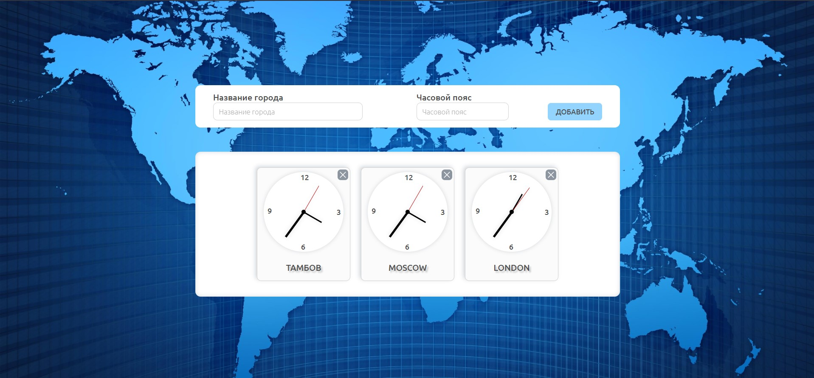

[GitHub Pages World-Clock](https://lekseff.github.io/World-Clock/)

Мировые часы
===

Наверняка вы видели в офисах многих компаний, установленные часы, показывающие время в разных столицах мира:
* New York
* Moscow
* London
* Tokyo 
и т.д.

Общая механика:

1. Вы заполняете поля название и временная зона (указываете смещение в часах относительно Гринвича) и нажимаете кнопку "Добавить"
2. Часы автоматически добавляются и начинают "тикать".
3. При нажатии на крестик рядом с часами часы автоматически удаляются.

